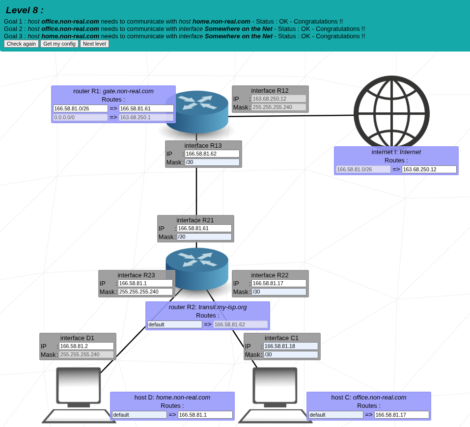
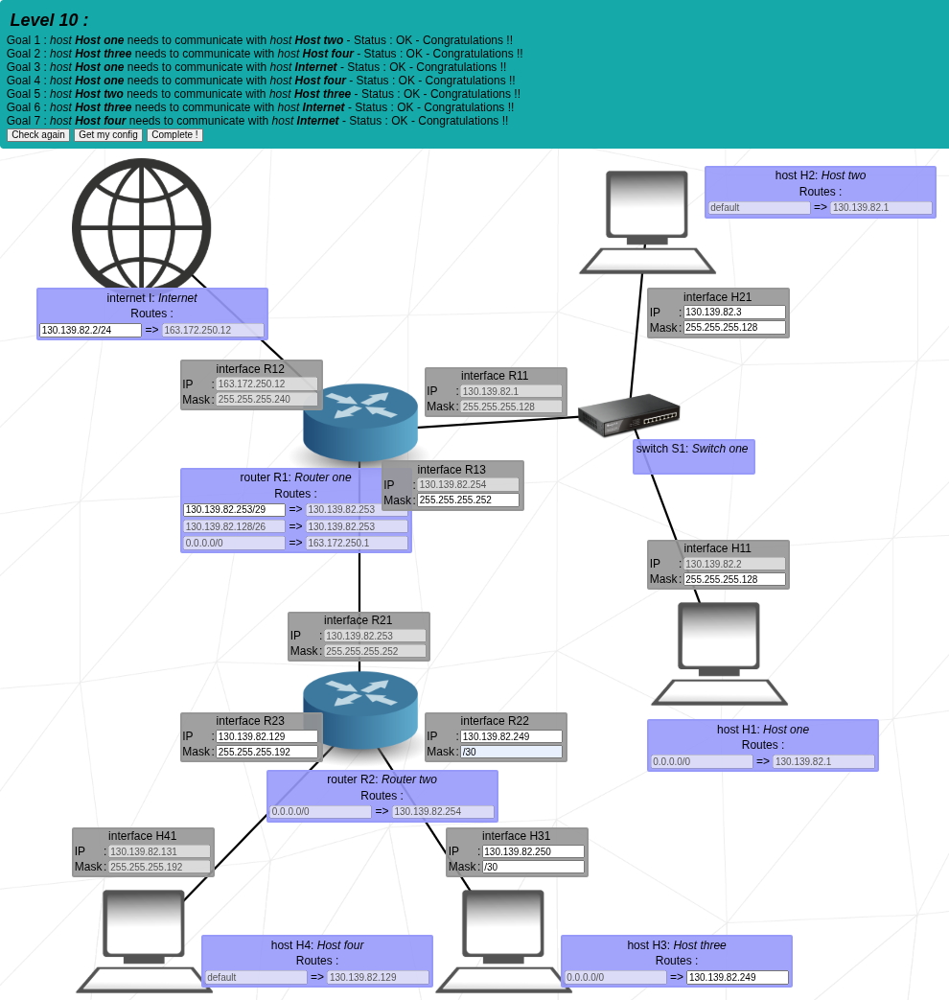

# 🧠 NetPractice — Advanced Networking & Routing Simulator

## 📘 Overview

**NetPractice** is a technical networking project designed to strengthen understanding of **IP addressing**, **subnetting**, and **routing logic** through practical configuration scenarios.
This repository documents my solutions, configurations, and theoretical notes from all **NetPractice levels (1–10)**.

Each level introduces new networking challenges — from basic local network communication to complex multi-router environments connected to the Internet.

This project was completed as part of the **1337 School curriculum**, focusing on **hands-on problem-solving** and **conceptual clarity** in computer networks.

---

## 🚀 Learning Objectives

* Master IPv4 **addressing schemes**, **subnet masks**, and **CIDR notation**.
* Configure **static routing** and **default routes** to establish end-to-end connectivity.
* Understand **Network Address Translation (NAT)** and how routers translate private to public IPs.
* Analyze **routing tables** and determine packet flow paths through networks.
* Comprehend and apply the **OSI model** and **TCP/IP stack** in real configurations.
* Compare routing protocols: **RIP**, **OSPF**, and **BGP** — their metrics, use cases, and differences.

---

## 🧩 Project Structure

```
NetPractice/
│
├── levels/
│   ├── level_01.png          # Topology diagrams per level
│   ├── level_02.png
│   ├── ...
│   ├── level_10.png
│
├── configs/
│   ├── level_01_config.json  # Router/host configuration exports
│   ├── ...
│   └── level_10_config.json
│
├── notes/
│   ├── networking_theory_summary.pdf  # Theoretical reference
│   ├── osi_model_explained.md
│   ├── routing_protocols.md
│   └── nat_explained.md
│
└── README.md
```

---

## ⚙️ Technical Concepts

### 1️⃣ **IP Addressing and Subnetting**

* IPv4: 32-bit addressing system split into **network** and **host** portions.
* Subnetting allows network division into smaller segments using a **subnet mask** or **CIDR** (e.g., `/24`, `/26`).
* Private ranges: `10.0.0.0/8`, `172.16.0.0/12`, `192.168.0.0/16`
* Each subnet includes:

  * **Network address** (identifies subnet)
  * **Broadcast address** (sends to all hosts)
  * **Usable host range**

### 2️⃣ **Routing Basics**

Routers make forwarding decisions based on their **routing tables**, choosing the best path using specific routes or a **default route** (`0.0.0.0/0`).
Each route entry has:

* **Destination network**
* **Subnet mask**
* **Next-hop IP address**

Routing types:

* **Static routing:** manually configured by administrators.
* **Dynamic routing:** learned automatically using protocols (RIP, OSPF, BGP).

### 3️⃣ **NAT (Network Address Translation)**

NAT allows private IPs to access the Internet by replacing the private address with the router’s **public IP**.

* **Static NAT:** one-to-one mapping.
* **Dynamic NAT:** uses a pool of public addresses.
* **PAT (Port Address Translation):** multiple devices share one public IP by tracking ports.

Advantages:

* Reduces public IP usage.
* Adds a layer of **security** by hiding internal IPs.
* Enables simultaneous Internet access for many devices.

### 4️⃣ **Routing Protocols**

| Protocol | Type            | Metric                 | Description                   | Used In                     |
| -------- | --------------- | ---------------------- | ----------------------------- | --------------------------- |
| **RIP**  | Distance Vector | Hop count              | Simple, uses periodic updates | Small networks              |
| **OSPF** | Link State      | Cost (bandwidth/speed) | Efficient and hierarchical    | Enterprise LANs             |
| **BGP**  | Path Vector     | Policy / AS path       | Internet-level routing        | Between ISPs (the Internet) |

---

## 🪜 **OSI Model & TCP/IP Stack**

### 🧠 OSI Model (7 Layers)

1. **Physical** – raw bits, cables, Wi-Fi
2. **Data Link** – MAC addresses, Ethernet, Switches
3. **Network** – IP addressing, Routers
4. **Transport** – TCP (reliable), UDP (fast)
5. **Session** – manages connections
6. **Presentation** – encryption, compression, encoding
7. **Application** – end-user protocols (HTTP, DNS, FTP)

### 🌐 TCP/IP Model (4 Layers)

| Layer              | OSI Equivalent | Description                                |
| ------------------ | -------------- | ------------------------------------------ |
| **Application**    | Layers 5–7     | Interfaces with user programs              |
| **Transport**      | Layer 4        | Manages end-to-end communication (TCP/UDP) |
| **Internet**       | Layer 3        | Logical addressing and routing (IP)        |
| **Network Access** | Layers 1–2     | Physical and data link transmission        |

---

## 💡 Example Analysis — Level 10

### Problem:

Router R1 could not reach the Internet when using specific routes (`/24`, `/30`).

### Solution:

Add a **default route** instead:

```
R1: 0.0.0.0/0 → 163.172.250.1
```

### Explanation:

* `/0` covers **all destinations** not found in the routing table.
* `/24` or `/30` only cover limited IP ranges (local networks).
* Routers use the **most specific match**, so `/0` ensures all external traffic goes to the Internet gateway.

✅ Result: All hosts and routers achieved Internet connectivity.

---

## 🧪 Tools & Environment

* **NetPractice** (1337 School networking project platform)
* **Wireshark** (for packet inspection)
* **Cisco Packet Tracer / GNS3** (for conceptual practice)
* **Linux utilities:**

  * `ping`, `traceroute`, `ip route`, `netstat`, `ifconfig`
* **JSON configuration exports** for route automation

---

## 🧭 Key Takeaways

* Deep understanding of **IP routing logic** and **network communication**.
* Ability to design and troubleshoot **complex topologies**.
* Clear mental model of how each **OSI layer** cooperates in packet transmission.
* Understanding of **how routers, switches, and hosts interact** in real environments.

---

## 📷 Example Screenshots

| Level | Description                                 | Image                            |
| ----- | ------------------------------------------- | -------------------------------- |
| 8     | Multi-router topology with Internet gateway |   |
| 10    | Complete routing and NAT simulation         |  |

---

## 👨‍💻 Author

**Adam Zahraoui**
Network Engineering Student • 1337 School • Aspiring Systems & Security Engineer
📧 [adamzahraoui30@gmail.com](mailto:adamzahraoui30@gmail.com)
🌐 [LinkedIn: Adam Zahraoui](https://www.linkedin.com/in/adam-zahraoui-a9bb8a32a/)

---

## 🗂️ License

This project is open for educational and non-commercial use.
Feel free to clone, study, or modify it for your own learning.
